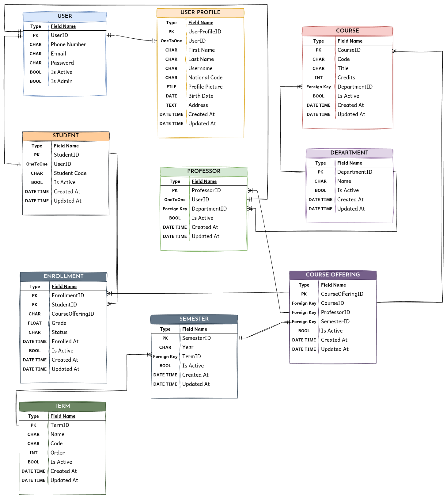

# College Management System

A backend system for managing university academic operations.

This project is being developed as a fun project to explore:

- Database design
- Django architecture
- REST API development
- Authentication and authorization
- Real-world relational modeling

---

## Overview

The system manages core university entities such as:

- Students
- Professors
- Departments
- Courses
- Course Offerings
- Semesters
- Enrollment
- Grades

The main goal is to design a scalable relational database and implement it using Django and Django REST Framework.

---

## Database Design

The first version of the ERD:

The editable Draw.io source file is available here:

[ERD Source](docs/erd.drawio)

---

## Main Features

### User Management
- Custom user authentication
- Student profiles
- Professor profiles

### Academic Management
- Department management
- Course management
- Semester management
- Course offerings

### Enrollment System
- Student course registration
- Grade management
- Enrollment status tracking

---

## Tech Stack

| Technology | Purpose |
|------------|---------|
| Python | Backend language |
| Django | Web framework |
| Django REST Framework | API development |
| PostgreSQL | Database |
| Docker | Containerization |

---

## Project Status

🚧 Under Development

Current stage:
- [x] Database design (MVP)
- [x] Django project initialization
- [ ] Models implementation
- [ ] REST API
- [ ] Authentication
- [ ] Automated tests
- [ ] Docker deployment

---

## Contributing

Contributions are welcome!

If you have an idea, find a bug, or want to improve the project, feel free to open an issue or submit a pull request.

Before contributing:

1. Fork the repository.
2. Create a new branch for your changes.
3. Make your changes and add tests when appropriate.
4. Make sure the project works correctly.
5. Open a pull request with a clear description of your changes.

> For larger changes, opening an issue first is recommended so the idea can be discussed before implementation.

---

## Future Improvements

Possible future features:

- Course prerequisites
- Class scheduling
- Attendance management
- Transcript generation
- GPA calculation
- Role-based permissions

---

## License

GPL-3.0 License
